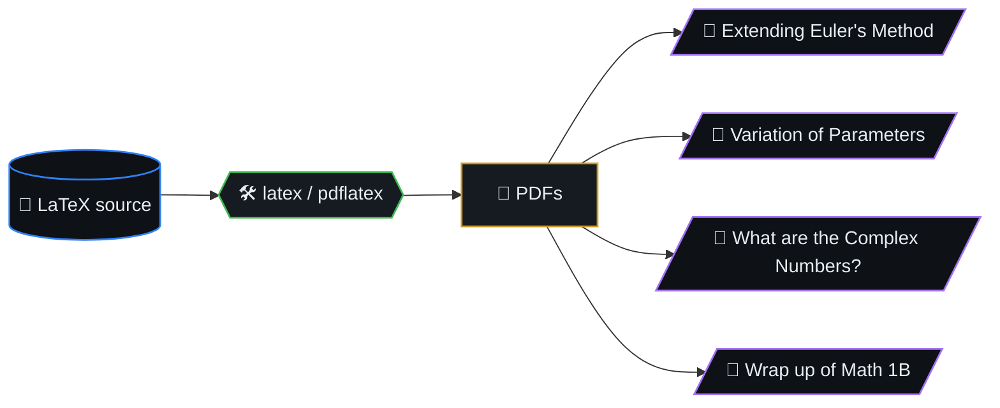

# Math

> Some of my undergraduate math projects, neatly typed in **LaTeX**.
> First-year topics that pushed my comfort zone — multivariable
> calculus, differential equations — and the first time I learned and
> fell in love with LaTeX. From here on out I swore to do all my math
> in LaTeX :)

## Table of contents

- [Contents](#contents)

## Contents

| File | Topic |
|---|---|
| `Extending Euler's Method.pdf` | Numerical ODE: extending Euler's method. |
| `Variation of Parameters.pdf` | Solving inhomogeneous linear ODEs via variation of parameters. |
| `What are the Complex Numbers?.pdf` | Construction and intuition for `ℂ`. |
| `Wrap up of Math 1B.pdf` | End-of-course synthesis (single-variable integral calc / series). |
